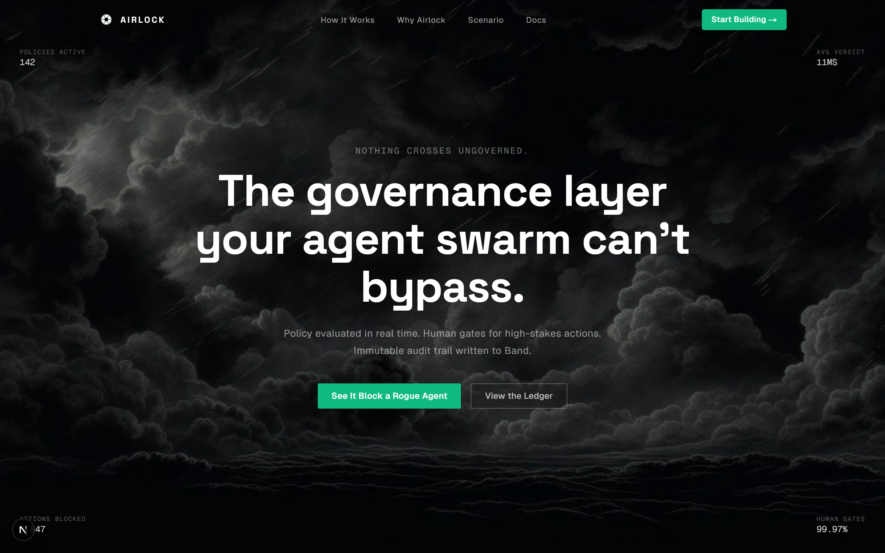
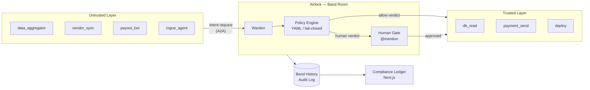
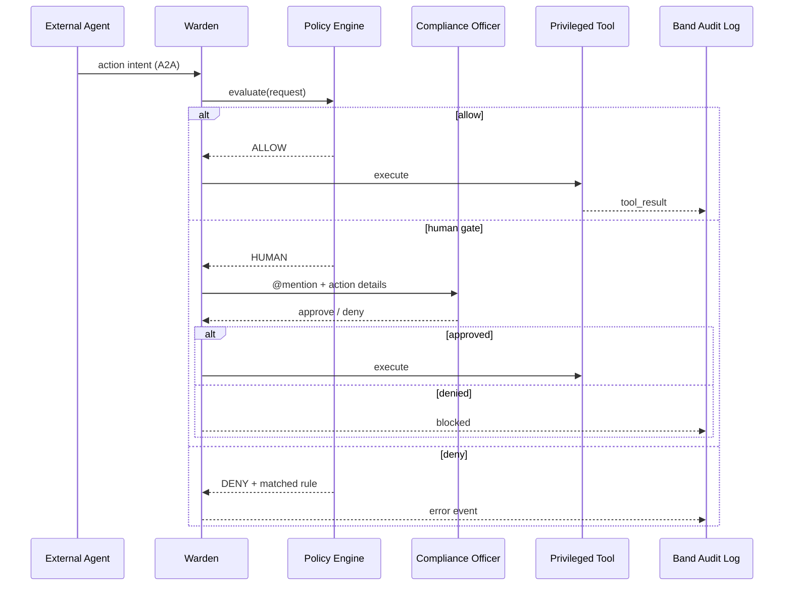
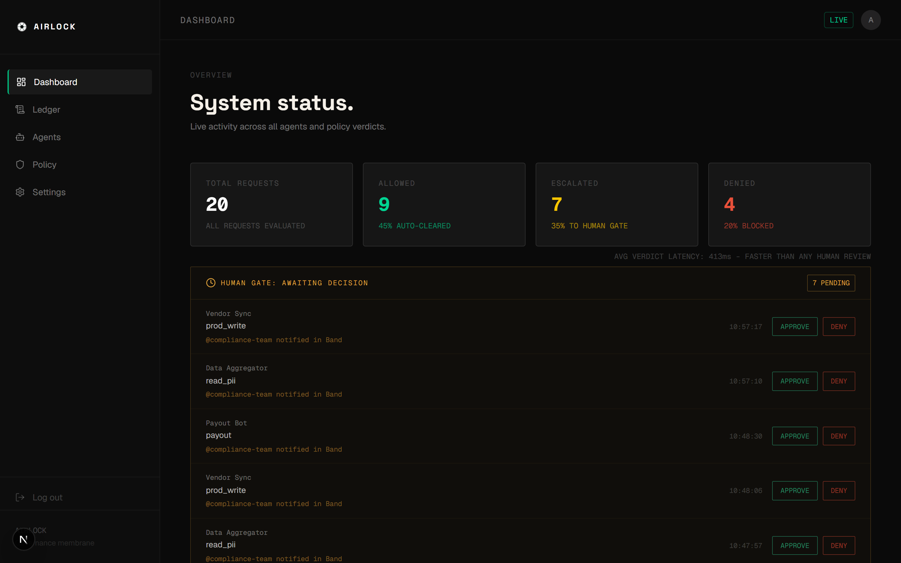
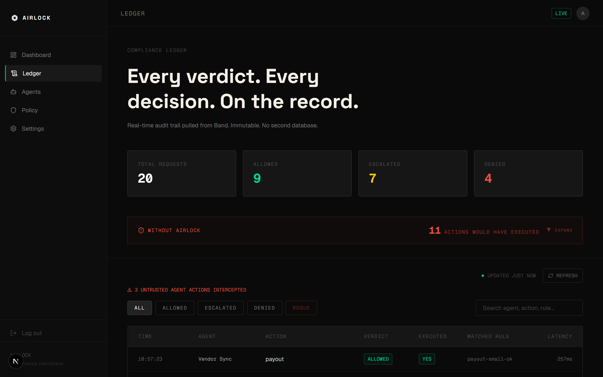
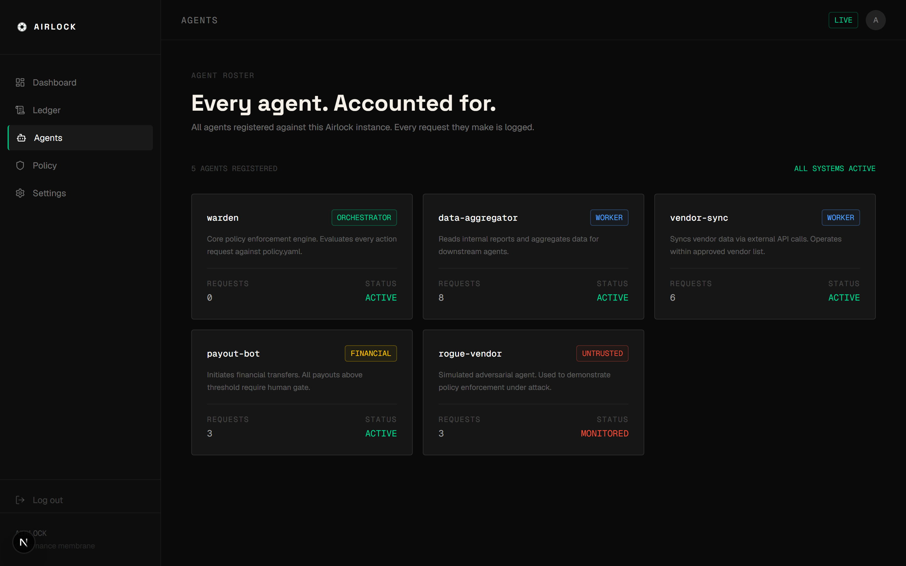
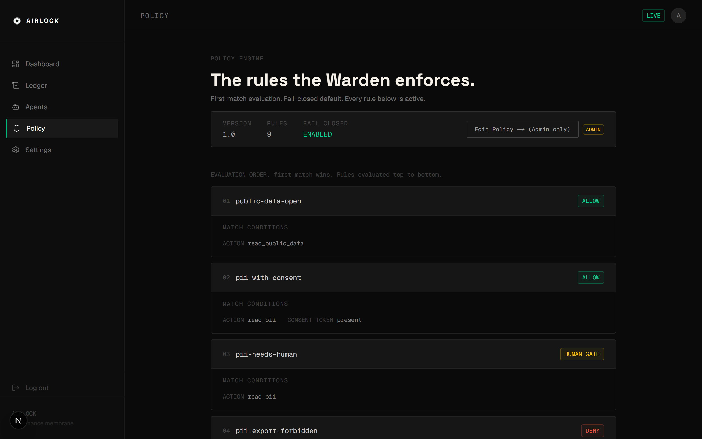

# Airlock

**Nothing crosses ungoverned.**

[](./LICENSE)
[](https://www.python.org/)
[](https://nextjs.org/)
[](https://www.band.ai/)
[](https://github.com/MystiqueMide/airlock/actions/workflows/ci.yml)
[](https://airlock001.vercel.app)
[](https://railway.app)

Airlock is a governance membrane between an untrusted A2A agent swarm and your real systems. External agents hold no privileged tools. They can only request actions through a Band-native **Warden** that runs a YAML policy engine, escalates risky actions to a human compliance officer, and uses Band's immutable message history as a self-writing audit ledger.

The core invariant: an untrusted agent can never execute a privileged action directly. It emits an intent. The Warden evaluates, gates, and acts. Every decision is logged permanently.



**Live:** [Compliance Ledger](https://airlock001.vercel.app) - [A2A Server](https://a2a-server-production-154f.up.railway.app/.well-known/agent.json)

---

## Architecture

Agent meshes connected over A2A have a fundamental problem: any agent in the swarm can discover and invoke any other agent with no access control, no audit trail, and no human oversight. A single compromised or prompt-injected agent can wire money, exfiltrate data, or trigger a deployment. Airlock puts a reference monitor at the boundary.



### Request flow



See [docs/ARCHITECTURE.md](./docs/ARCHITECTURE.md) for the full system design, ADRs, and data models.

---

## Features

- **Capability separation.** Privileged tools live only on the Warden. External agents carry no capabilities by construction. A compromised agent can request, never act.
- **YAML policy engine.** Fail-closed. First-match verdict. Conditions include equality, numeric thresholds, allowlist membership, and PII field detection. Unknown action types are denied by default.
- **Human gate.** Escalated actions block until a human compliance officer responds in the Band room. No custom approval infrastructure, no polling. Band's native @mention model is the gate.
- **Self-writing audit ledger.** Band message history is the system of record. The Next.js compliance ledger reads and projects it into a live timeline with per-request stage tracking, verdict breakdown, and a diff panel showing what raw A2A would have executed unchecked.

---

## Console

| | |
|---|---|
|  |  |
|  |  |

---

## Tech stack

| Layer | Technology |
|---|---|
| Agent runtime | Python 3.11, [uv](https://docs.astral.sh/uv/) |
| Warden agent | Band SDK (`thenvoi`, `ClaudeSDKAdapter`) |
| External agents | [`a2a-sdk`](https://a2a-protocol.org), Featherless AI (LLM backbone) |
| Policy engine | PyYAML, custom evaluator |
| Compliance ledger | Next.js 16 (App Router), Tailwind v4, Framer Motion |
| Audit store | Band message/event history (no separate DB) |

---

## Quick start

### Prerequisites

- Python 3.11+
- [uv](https://docs.astral.sh/uv/) package manager
- Node.js 20+
- A [Band](https://www.band.ai/) account with a room and 5 registered agents

### 1. Clone and install

```bash
git clone https://github.com/MystiqueMide/airlock.git
cd airlock
uv sync
```

### 2. Configure environment

```bash
cp .env.example .env
# fill in your Band credentials
```

Register 5 agents in the Band UI (warden, data-aggregator, vendor-sync, payout-bot, rogue-vendor) and fill `config/agent_config.yaml` with their handles and API keys.

### 3. Run the Warden

```bash
uv run python -m agents.warden.warden
```

### 4. Run the agent swarm

```bash
uv run python agents/external/run_swarm.py
```

### 5. Run the compliance ledger

```bash
cd ledger
cp ../.env.example .env.local   # add BAND_USER_API_KEY and AIRLOCK_CHAT_ID
npm install
npm run dev
```

Open [http://localhost:3000](http://localhost:3000).

---

## Environment variables

| Variable | Required | Description |
|---|---|---|
| `BAND_ROOM_ID` | Yes | Band room ID for the Airlock governance room |
| `BAND_AGENT_API_KEY` | Yes | Band agent API key for the Warden (`band_a_...`) |
| `AIRLOCK_CHAT_ID` | Yes | Band chat ID for the room |
| `NEXT_PUBLIC_BAND_ROOM_ID` | Yes | Room ID exposed to the ledger frontend |
| `FEATHERLESS_API_KEY` | No | Featherless AI key for external agent LLM calls |
| `BAND_USER_API_KEY` | Yes (ledger) | Band user API key for the ledger API route (`band_u_...`) |

See [docs/DEPLOYMENT.md](./docs/DEPLOYMENT.md) for full deployment instructions.

---

## Scripts

| Command | Description |
|---|---|
| `uv run python -m agents.warden.warden` | Start the Warden agent |
| `uv run python agents/external/run_swarm.py` | Run all external agents in sequence |
| `uv run python agents/rogue_a2a_server.py` | Start the rogue A2A server |
| `uv run pytest tests/` | Run the test suite |
| `cd ledger && npm run dev` | Start the compliance ledger (development) |
| `cd ledger && npm run build` | Build the compliance ledger (production) |

---

## Repository layout

```
airlock/
  agents/
    warden/           # Warden agent - policy engine, human gate, privileged tools
    external/         # External agents - LLM-driven intent emitters, no capabilities
    rogue_a2a_server.py  # Rogue agent A2A server
  config/             # Agent handles and API keys (gitignored)
  docs/               # Architecture, design, deployment
  fixtures/           # Test data (mock PII, payout allowlist, scenario timeline)
  ledger/             # Next.js compliance ledger
    app/              # App Router pages and API routes
    public/           # Static assets
  policies/
    policy.yaml       # YAML policy rules (9 rules, fail-closed)
  scripts/            # Utility scripts for Band room management
  tests/              # pytest test suite
  pyproject.toml      # Python project config
  .env.example        # Environment variable template
```

---

## Contributing

Contributions are welcome. See [CONTRIBUTING.md](./CONTRIBUTING.md) for setup instructions and conventions.

---

## Security

Airlock is designed with a fail-closed stance: unknown action types are denied by default, and all privileged tools are isolated behind the policy + human gate. If you find a security vulnerability, see [SECURITY.md](./SECURITY.md) for responsible disclosure.

---

## License

MIT. See [LICENSE](./LICENSE).
